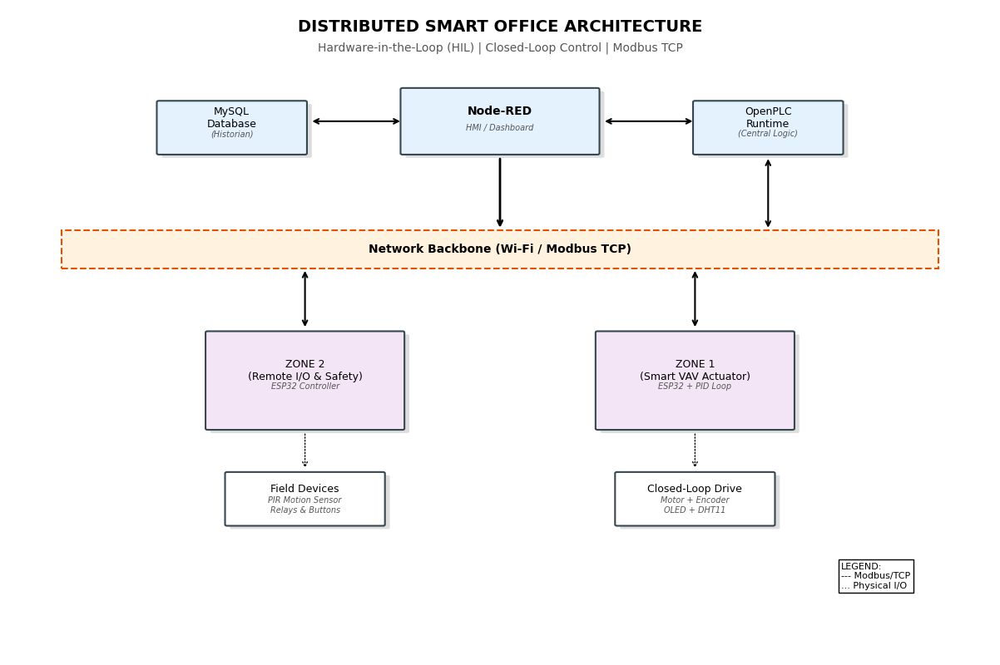
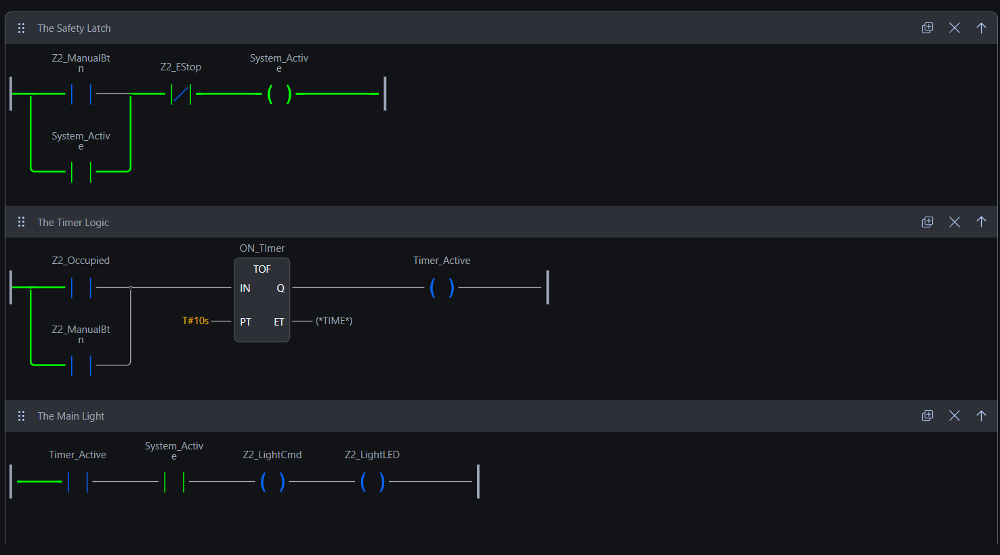
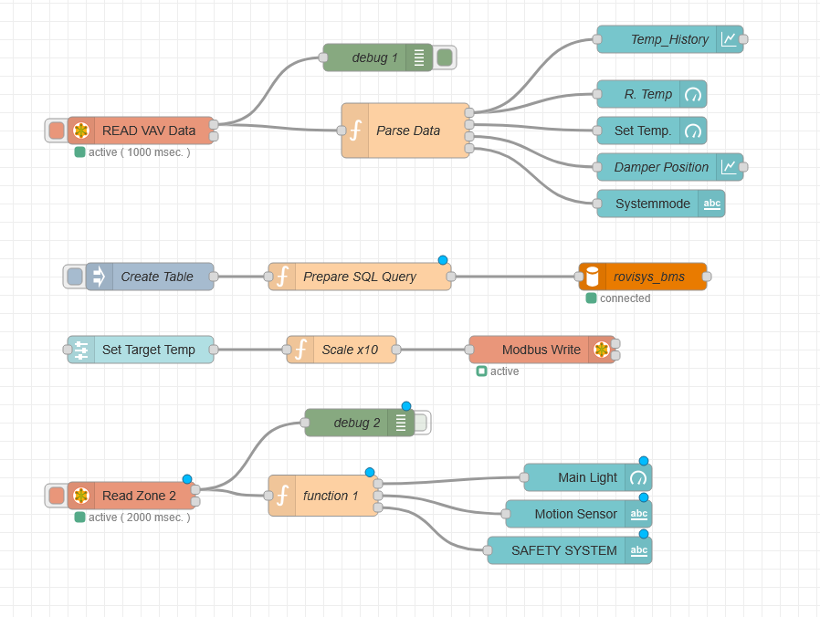
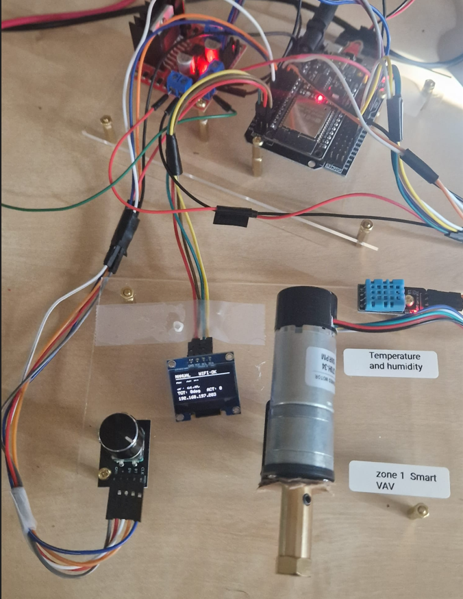
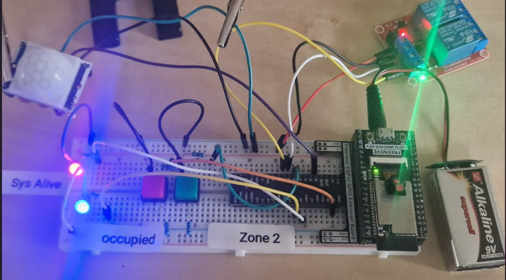

# Distributed Building Automation System (BAS) Prototype

**Author:** Fayez Alallaf  
**Tech Stack:** OpenPLC Runtime (IEC 61131-3), Node-RED, Modbus TCP, ESP32, MySQL

## Overview
This project demonstrates a complete **distributed building automation** stack—combining **edge control**, **central PLC logic**, a **web HMI**, and **historian logging** using **standard industrial interfaces**.

Unlike single-board “blink” demos, this prototype mimics how real BAS/industrial systems are built:
- Multiple field nodes (zones)
- Central supervision and safety logic
- Standard protocol communication (Modbus TCP)
- Operator dashboard + data logging

---

## System Architecture

### Zone 1 — Smart VAV Actuator (Edge Control)
- ESP32 runs **local closed-loop control** (PID).
- Controls a motorized damper using encoder feedback.
- Can accept commands/setpoints from the Supervisor PC.

### Zone 2 — Remote Safety / I/O (Distributed I/O)
- ESP32 acts as a remote I/O block:
  - reads a PIR occupancy sensor
  - drives lighting relays
  - supports an E-Stop input
- **Control logic is centralized** on the Supervisor PC (OpenPLC ladder), not on the ESP32.

### Supervisor PC (Central Station)
- **OpenPLC Runtime:** ladder logic (interlocks, latch behavior)

- **Node-RED:** HMI dashboard (operator controls + monitoring)

- **MySQL:** historian logging (telemetry storage)

---

## Hardware

### Zone 1 Hardware (VAV Control)
- ESP32 (DevKit V1)
- L298N motor driver + DC motor (damper simulation)
- Rotary encoder (position feedback)
- DHT11 (temperature/humidity)
- OLED display + knob (local interface / manual adjustments)

### Zone 2 Hardware (Safety / Lighting)
- ESP32 (DevKit V1)
- HC-SR501 PIR motion sensor
- 2-channel relay module (5V)
- Physical E-Stop button

---

## How to Run It
1.  **Network:** All devices must be on the same Wi-Fi (I used a phone hotspot).
2.  **Field Nodes:** Flash the ESP32s with the firmware in `/firmware`.
3.  **Logic:** Load the `.st` file into OpenPLC Runtime on your PC.
4.  **HMI:** Import the `flows.json` into Node-RED.